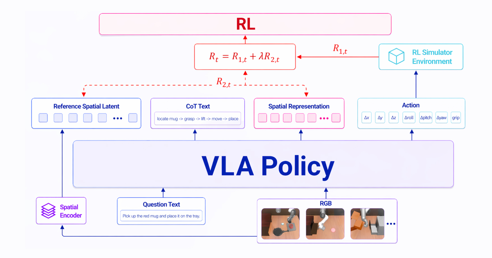

# SpaRe-lite LIBERO-10 Offline RL Reproduction

This repository contains the lightweight reproduction pipeline, dataset manifest,
training/evaluation logs, and result figures for a constrained offline-RL study on
SimpleVLA-RL + LIBERO-10.

## Pipeline Overview



## Claim

Under a constrained setting with no online RL interaction and only a small set of
trainable policy components, R1/R2 still provide a measurable positive learning
signal. The goal is not to match the full author-provided online RL checkpoint,
but to show that the offline R1/R2 reward design can improve over a supervised
baseline under limited compute and time.

## Main Results

LIBERO-10 success rates:

| Checkpoint / eval run | Success | Rate |
|---|---:|---:|
| `Openvla-oft-SFT-libero10-traj1_eval-libero10` | 80 / 496 | 16.13% |
| `openvla-oft-libero10-traj1-rl_eval-libero10` | 430 / 496 | 86.69% |
| `Openvla-oft-SFT-libero10-traj1_offline-r1_libero10-full409_eval-libero10` | 86 / 500 | 17.20% |
| `Openvla-oft-SFT-libero10-traj1_offline-r1r2_libero10-full409_eval-libero10` | 92 / 500 | 18.40% |
| `openvla-oft-libero10-traj1-rl_offline-r1_libero-spatial-full_eval-libero10` | 355 / 448 | 79.24% |
| `openvla-oft-libero10-traj1-rl_offline-r1r2_libero-spatial-full_eval-libero10` | 364 / 448 | 81.25% |

The most important controlled comparison is:

`Official SFT < R1 from SFT < R1+R2 from SFT`

The spatial-offline-trained pair was trained from a different offline data source
(`libero_spatial_transition_full.jsonl`) and is included as an empirical
cross-dataset reference rather than the strict LIBERO-10 full409 comparison.

## What This Repo Reproduces

This repository packages two related training/evaluation branches:

1. **Controlled LIBERO-10 branch:** start from the official SFT checkpoint
   `Haozhan72/Openvla-oft-SFT-libero10-traj1`, train offline R1 and R1+R2 on
   `libero10_expert_plus_sft_failures_409.jsonl`, export full VLA checkpoints,
   then evaluate on LIBERO-10 with the official SimpleVLA-RL rollout pipeline.
   This is the strict apples-to-apples result supporting
   `SFT < R1 < R1+R2`.

2. **Post-RL spatial-data reference branch:** start from the official post-RL
   checkpoint `Haozhan72/openvla-oft-libero10-traj1-rl`, train offline R1 and
   R1+R2 on the earlier `libero_spatial_transition_full.jsonl` data source, then
   evaluate the exported checkpoints on LIBERO-10. This branch is included as a
   reference because it produced strong LIBERO-10 results, but it is not the
   primary controlled LIBERO-10 full409 comparison.

Both branches use the same evaluation backend: the official SimpleVLA-RL
LIBERO rollout code, with only the runtime patch documented in `patches/` when
needed for worker startup stability.

## Repository Layout

- `spare_lite/`: data adapters, reward helpers, and dataset extraction utilities.
- `spare_lite_offline_rl/`: IQL-style offline RL training code.
- `scripts/`: SFT failure rollout collection script.
- `tools/`: checkpoint export/download/launcher utilities.
- `data/`: lightweight final LIBERO-10 JSONL dataset and manifest.
- `results/`: final summaries and eval logs for the SFT-baseline full409 run.
- `figures/`: pipeline and per-task comparison figures.
- `analysis/`: parsed rollout-count JSON and recovered evaluation metadata.
- `patches/`: minimal SimpleVLA-RL runtime patch used for LIBERO multiprocessing.

## Dataset

The final dataset used for the strict SFT-baseline comparison is:

`data/libero10_expert_plus_sft_failures_409.jsonl`

It contains:

- 138,090 expert transitions from full LIBERO-10 demonstrations.
- 26,176 real failed-policy transitions from 409 official-SFT failed rollout episodes.
- 164,266 total transitions.
- `quality=expert/failure`, `reward`, and `rollout_success`/failure metadata so the
  trainer can avoid treating failure actions as behavior-cloning positives.

Important: the JSONL references image paths from the remote extraction layout.
For a fresh machine, regenerate or remap images using the extraction scripts in
`spare_lite/` and the collection script in `scripts/`. The JSONL itself is tracked
with Git LFS because it is larger than GitHub's normal 100 MB file limit.

Clone this repository with Git LFS enabled:

```bash
git lfs install
git clone https://github.com/Leo-Haochen-Liu/spare-lite-libero10-offline-rl.git
cd spare-lite-libero10-offline-rl
git lfs pull
```

## Official Checkpoints

Download the author-provided checkpoints separately:

- Official SFT baseline:
  [`Haozhan72/Openvla-oft-SFT-libero10-traj1`](https://huggingface.co/Haozhan72/Openvla-oft-SFT-libero10-traj1)
- Official post-RL baseline:
  [`Haozhan72/openvla-oft-libero10-traj1-rl`](https://huggingface.co/Haozhan72/openvla-oft-libero10-traj1-rl)

Example download commands:

```bash
# Install the current Hugging Face CLI if needed:
# pip install -U huggingface_hub

mkdir -p checkpoints

hf download Haozhan72/Openvla-oft-SFT-libero10-traj1 \
  --local-dir checkpoints/Openvla-oft-SFT-libero10-traj1

hf download Haozhan72/openvla-oft-libero10-traj1-rl \
  --local-dir checkpoints/openvla-oft-libero10-traj1-rl
```

If your network cannot access the Hugging Face Hub directly, set a mirror endpoint
before downloading:

```bash
export HF_ENDPOINT=https://hf-mirror.com
```

The local paths used in our run were:

- `/root/autodl-tmp/official_eval_sandboxes/sft_libero10_full`
- `/root/autodl-tmp/official_eval_sandboxes/postrl_libero10_full`

The post-RL sandbox used hard links to the official checkpoint plus the missing
custom-code files (`train_utils.py`, `constants.py`) needed by
`trust_remote_code=True`.

In our downloaded post-RL directory, the model weights were present but
`train_utils.py` and `constants.py` were missing. We copied those custom-code
files from a working SimpleVLA/OpenVLA-OFT sandbox into a writable sandbox copy.
This changes only local loading/runtime files, not model weights.

## External Code Dependencies

This repo is not a full vendor copy of SimpleVLA-RL, LIBERO, or SpatialVLA.
Install/clone those separately:

- SimpleVLA-RL official pipeline:
  [`PRIME-RL/SimpleVLA-RL`](https://github.com/PRIME-RL/SimpleVLA-RL).
  Our AutoDL run used commit
  `7c51662df27b586f9e8a1ab35fcf849f2b8852f9`. Apply
  `patches/simplevla_rl_libero_spawn_runtime.patch` only if Ray/LIBERO env
  workers fail with CUDA fork initialization errors.
- LIBERO benchmark code and assets: required for online rollout evaluation.
- SpatialVLA checkpoint: used as the spatial reward/model backend in the offline
  training script.

The exact remote paths used in our AutoDL run were:

```text
/root/autodl-tmp/SimpleVLA-RL
/root/autodl-tmp/LIBERO
/root/autodl-tmp/checkpoints/spatialvla-4b-224-pt
```

If using the official SimpleVLA-RL evaluation scripts, set the usual LIBERO
headless rendering environment:

```bash
export MUJOCO_GL=egl
export PYOPENGL_PLATFORM=egl
export ROBOT_PLATFORM=LIBERO
```

## Compute Used

The final remote AutoDL experiments were run on:

- GPU: 2 x NVIDIA RTX PRO 6000 Blackwell Server Edition, 97,887 MiB each.
- CPU: Intel Xeon Platinum 8470Q, 208 logical CPUs.
- RAM: about 1.0 TiB.
- Training/eval mode: two single-GPU jobs were often run in parallel, one per
  GPU. Each LIBERO rollout eval used `VAL_BATCH_SIZE=1`.

The project was designed for constrained compute: no online RL interaction, no
full-parameter fine-tuning, and only a small set of policy modules unfrozen.

## Training Configuration

The strict SFT-baseline experiment used:

- Base policy: official SFT checkpoint.
- Dataset: `libero10_expert_plus_sft_failures_409.jsonl`.
- Batch size: 16.
- Gradient accumulation: 2.
- Steps: 500.
- Learning rate: `5e-6`.
- IQL expectile: `0.7`.
- CQL alpha: `0.1`.
- R1-only: `lambda_align=0.0`.
- R1+R2: `lambda_align=0.2`, `r2_bias=0.10`.
- Trainable policy modules:
  - `language_model.model.layers.30.`
  - `language_model.model.layers.31.`
  - `language_model.norm`
  - `language_model.lm_head`
  - `multi_modal_projector`

Example:

```bash
export ROBOT_PLATFORM=LIBERO
export PYTHONPATH=/path/to/SpaRe-lite:/path/to/LIBERO:$PYTHONPATH

python -m spare_lite_offline_rl.train_iql_style_transition \
  --jsonl-path data/libero10_expert_plus_sft_failures_409.jsonl \
  --policy-model /path/to/Openvla-oft-SFT-libero10-traj1 \
  --spatial-model /path/to/spatialvla-4b-224-pt \
  --spatial-backend spatialvla \
  --batch-size 16 \
  --max-steps 500 \
  --grad-accumulation-steps 2 \
  --lambda-align 0.2 \
  --r2-bias 0.10 \
  --policy-trainable-pattern language_model.model.layers.30. \
  --policy-trainable-pattern language_model.model.layers.31. \
  --policy-trainable-pattern language_model.norm \
  --policy-trainable-pattern language_model.lm_head \
  --policy-trainable-pattern multi_modal_projector \
  --checkpoint-dir outputs/r1r2
```

## Evaluation

Evaluation uses the official SimpleVLA-RL LIBERO rollout pipeline. Before running
LIBERO eval on our AutoDL instance, we applied the small runtime patch in:

`patches/simplevla_rl_libero_spawn_runtime.patch`

It changes LIBERO env worker multiprocessing from default fork behavior to a
spawn context to avoid CUDA initialization failures inside Ray workers. It does
not change model logic, action decoding, reward computation, or success criteria.

Generated figures:

- `figures/libero10_sft_baseline_full409_offline_rl_per_task.png`
- `figures/libero10_postrl_baseline_offline_rl_per_task.png`

Parsed counts:

- `analysis/libero10_final_comparison_counts.json`

## Reproduction Checklist

To reproduce the strict SFT-baseline result from scratch:

1. Clone this repo with Git LFS and pull the tracked JSONL dataset.
2. Clone [`PRIME-RL/SimpleVLA-RL`](https://github.com/PRIME-RL/SimpleVLA-RL)
   and prepare LIBERO according to the SimpleVLA-RL instructions.
3. Download the official SFT checkpoint
   [`Haozhan72/Openvla-oft-SFT-libero10-traj1`](https://huggingface.co/Haozhan72/Openvla-oft-SFT-libero10-traj1).
4. Download the official post-RL checkpoint
   [`Haozhan72/openvla-oft-libero10-traj1-rl`](https://huggingface.co/Haozhan72/openvla-oft-libero10-traj1-rl)
   if you want to reproduce the upper-reference baseline or the spatial-data
   reference branch.
5. Download/provide the SpatialVLA backend checkpoint used by the training
   command.
6. Train R1 and R1+R2 with the hyperparameters above.
7. Export partial SpaRe-lite checkpoints into full VLA checkpoint directories
   using `tools/build_eval_model_from_partial_ckpt.py`.
8. Run LIBERO-10 evaluation through SimpleVLA-RL, applying
   `patches/simplevla_rl_libero_spawn_runtime.patch` only if CUDA fork errors
   appear in the LIBERO worker processes.

Common failure modes we observed:

- Missing custom-code files in writable checkpoint sandboxes can break
  `trust_remote_code=True` loading.
- LIBERO suite-specific normalization statistics must be compatible with the
  benchmark being evaluated.
- All-zero spatial-suite evals can indicate a suite/checkpoint mismatch rather
  than a broken model.
- CUDA fork initialization errors inside Ray/LIBERO workers are runtime issues;
  the provided patch switches those workers to a spawn context without changing
  model logic.

## Large Artifacts

Full exported VLA checkpoints are about 29 GB each and are intentionally not
committed to normal Git. Use Hugging Face Hub, GitHub Releases, or another object
store for those files.

Relevant produced checkpoint directories in our remote run:

- `libero10_full409_r1` (~29 GB): SFT baseline + LIBERO-10 full409 + R1.
- `libero10_full409_r1r2` (~29 GB): SFT baseline + LIBERO-10 full409 + R1+R2.
- `libero_spatial_full_r1` (~29 GB): post-RL baseline + spatial offline data + R1.
- `libero_spatial_full_r1r2` (~29 GB): post-RL baseline + spatial offline data + R1+R2.

The partial training checkpoints are about 2.1 GB each.

The first two exported checkpoints have been transferred to local staging for
Hugging Face upload. After publishing, add the final Hugging Face model links
here so users can evaluate without retraining. They are not required to
understand or rerun the pipeline from the official checkpoints, but they are
useful for direct verification.

Suggested Hugging Face model IDs:

- `Leo-Haochen-Liu/Openvla-oft-SFT-libero10-traj1-offline-r1-libero10-full409`
- `Leo-Haochen-Liu/Openvla-oft-SFT-libero10-traj1-offline-r1r2-libero10-full409`
- `Leo-Haochen-Liu/openvla-oft-libero10-traj1-rl-offline-r1-libero-spatial-full`
- `Leo-Haochen-Liu/openvla-oft-libero10-traj1-rl-offline-r1r2-libero-spatial-full`

## Notes

This repo is meant to preserve the reproducible pipeline and the final
experiment evidence. It is intentionally lightweight enough for GitHub; large
checkpoint binaries and extracted image folders should be distributed separately.
