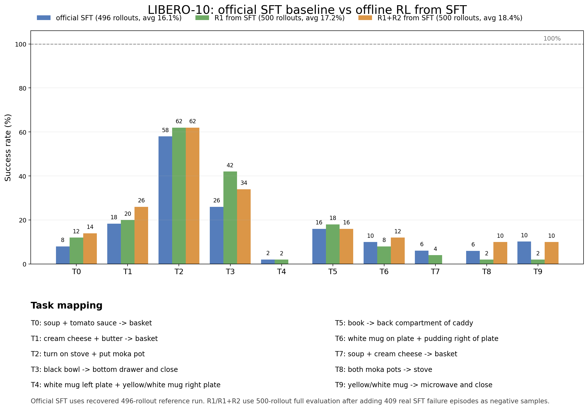
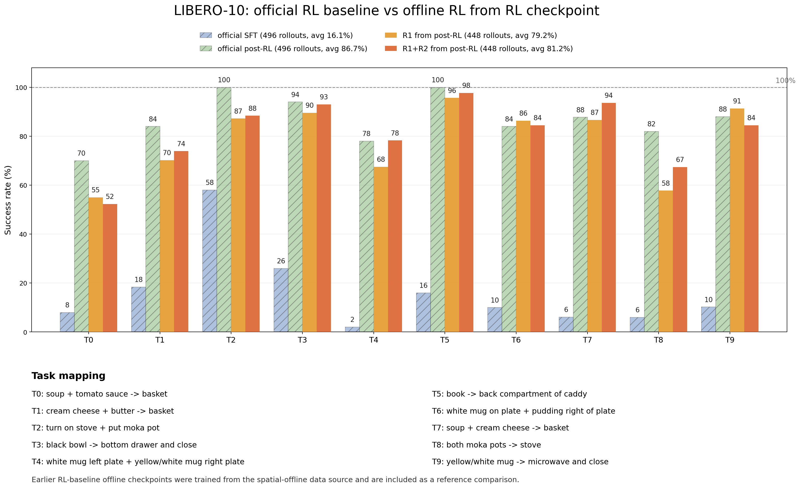

# SpaRe-lite: Resource-Constrained Offline Reinforcement Learning for Vision-Language-Action Policies on LIBERO-10

**Authors:** TODO: team member names and UM emails

## Abstract

Online reinforcement learning for vision-language-action (VLA) policies can improve robotic manipulation performance, but it is expensive, infrastructure-heavy, and difficult to reproduce under limited compute. This project studies a constrained alternative: can a public supervised fine-tuned VLA checkpoint be improved using only offline data and a small number of trainable policy parameters? We build a reproducible SimpleVLA-RL and LIBERO-10 pipeline around the author-provided OpenVLA-OFT checkpoints, construct an offline RL dataset from full LIBERO-10 expert demonstrations plus 409 real failed rollouts from the official SFT policy, and train two IQL-style variants using the SpaRe-lite rewards R1 and R1+R2. In the controlled comparison from the official SFT checkpoint, the baseline achieves 80/496 successes (16.13%), while our R1 model reaches 86/500 (17.20%) and R1+R2 reaches 92/500 (18.40%). The absolute gain is modest, but the ordering `SFT < R1 < R1+R2` supports the hypothesis that auxiliary spatial reward signals can provide measurable improvement even without online RL and with only a small subset of policy layers updated. We also document engineering and reproducibility issues encountered in official checkpoint evaluation, including custom-code loading, benchmark-specific normalization keys, and LIBERO multiprocessing failures.

## 1. Introduction

Vision-language-action models aim to map language instructions and visual observations directly into robot actions. Recent VLA systems such as OpenVLA and OpenVLA-OFT provide a practical path toward general-purpose manipulation policies, while reinforcement-learning extensions such as SimpleVLA-RL show that online interaction can substantially improve task success. However, online RL for robotic manipulation is costly: it requires repeated simulator or real-environment interaction, careful environment initialization, GPU-heavy rollout workers, and long debugging cycles. These constraints make it difficult for small class-project teams to reproduce the full online RL pipeline, especially when working with large public VLA checkpoints.

This project asks a narrower technical question: under a resource-constrained setting, can offline RL still provide a measurable improvement over a public SFT VLA policy? We do not attempt to match the full author-provided online RL checkpoint. Instead, we study whether a lightweight offline reward-learning setup can move the policy in the right direction when online interaction is unavailable. Our setting is intentionally constrained: we train from fixed data, update only a small subset of policy parameters, and evaluate on the standard LIBERO-10 online rollout protocol.

Our main result is that offline R1/R2 training produces a small but consistent improvement over the official SFT baseline. The official SFT checkpoint achieves 80/496 successes on LIBERO-10. Training with R1 improves this to 86/500, and adding the auxiliary R2 reward improves it further to 92/500. This is far below the official post-RL checkpoint, which achieves about 430/496 successes, but that gap is expected because the official checkpoint benefits from full online RL. The contribution of this project is therefore not state-of-the-art performance; it is a reproducible technical study showing that the R1/R2 reward direction has measurable value under limited compute.

Our contributions are:

1. We reproduce and package a SimpleVLA-RL + LIBERO-10 evaluation workflow using the author-provided SFT and post-RL checkpoints.
2. We construct a LIBERO-10 offline RL dataset that combines full expert demonstration transitions with real failed trajectories collected from the official SFT policy.
3. We implement an IQL-style offline RL training pipeline that updates only a small subset of OpenVLA-OFT policy parameters.
4. We evaluate R1 and R1+R2 variants under a controlled comparison from the official SFT checkpoint.
5. We document major reproducibility bottlenecks and runtime fixes so that future teams can reproduce or extend the pipeline.

## 2. Background and Related Work

### Vision-language-action policies

VLA policies combine visual observations, language instructions, and action prediction in a single model. In the OpenVLA-OFT setting used by SimpleVLA-RL, the policy receives an image observation and a natural-language task description, then predicts action tokens corresponding to robot control commands. This architecture is powerful but large: the public checkpoints used in this project are approximately 8B-parameter models, making full fine-tuning expensive.

### LIBERO benchmark

LIBERO is a benchmark suite for robot manipulation. We focus on LIBERO-10, which contains ten long-horizon manipulation tasks. The primary metric is rollout success rate:

```text
Success Rate = (# successful rollouts) / (# total rollouts).
```

Following the official evaluation protocol, each model is evaluated over roughly 50 trials per task. We report both aggregate success rate and per-task success rate.

### Offline reinforcement learning and IQL

Offline RL learns from a fixed dataset without additional environment interaction. This is attractive for VLA policies because online rollout collection can be expensive and fragile. However, offline RL also requires care: if the dataset contains only expert demonstrations, training may reduce to behavior cloning; if failure trajectories are included, the algorithm must distinguish high-quality and low-quality actions instead of imitating every action blindly.

Our training pipeline follows an IQL-style objective. Let `D` be a fixed transition dataset. A Q-function estimates action quality, a value function estimates state value, and the policy is trained to place more probability on actions with high estimated advantage. A simplified form of the losses is:

```text
L_Q = E_D[(Q(s,a) - y)^2],
```

```text
L_V = E_D[L_2^tau(Q(s,a) - V(s))],
```

```text
L_pi = - E_D[exp(beta A(s,a)) log pi_theta(a|s)].
```

Here `A(s,a) = Q(s,a) - V(s)` is an advantage estimate. The expectile loss `L_2^tau` asymmetrically fits the value function to high-value actions, and the actor loss weights behavior cloning by estimated advantage. In our implementation, a CQL-style regularization term is also used to reduce Q-value overestimation.

### SpaRe-lite rewards

The reward used in this project has two components:

```text
r(s_t, a_t) = r_1(s_t, a_t) + lambda r_2(s_t, a_t).
```

R1 is the primary reward signal, while R2 is an auxiliary spatial/alignment reward. In the R1-only setting, `lambda = 0`. In the R1+R2 setting, `lambda = 0.2` and `r2_bias = 0.10`. The purpose of the experiment is to test whether adding R2 provides an additional learning signal beyond R1 under the same data and training budget.

## 3. Method

Figure 1 summarizes the SpaRe-lite workflow.


### 3.1 Dataset construction

The final dataset for the controlled LIBERO-10 experiment is:

```text
data/libero10_expert_plus_sft_failures_409.jsonl
```

It contains two sources of transitions:

1. **Expert transitions:** full LIBERO-10 demonstration transitions.
2. **Failure transitions:** real failed rollout episodes generated by the official SFT checkpoint.

The dataset contains 138,090 expert transitions and 26,176 failure transitions from 409 failed SFT episodes, for a total of 164,266 transitions. Each transition stores metadata such as `quality`, `reward`, and rollout-success information. This is important because failure actions should not be treated as ordinary behavior-cloning targets. Behavior cloning (BC) trains a policy to imitate the provided action. If failed SFT actions were mixed into BC as positives, the policy would learn to imitate bad behavior. In our offline RL setting, these trajectories instead serve as low-quality contrastive data: they help the value and Q functions distinguish expert-like behavior from failed behavior.

We can write the dataset as:

```text
D = D_expert union D_failure.
```

The training objective uses the quality/reward annotations to learn from both parts of the dataset without assuming that every action is equally desirable.

### 3.2 Limited policy adaptation

Because the VLA model is large, we do not full fine-tune all policy parameters. Instead, we update a small trainable subset:

```text
theta_trainable subset theta_policy.
```

The trainable modules are:

- `language_model.model.layers.30`
- `language_model.model.layers.31`
- `language_model.norm`
- `language_model.lm_head`
- `multi_modal_projector`

This choice is a practical compromise. Updating only the last language-model layers, final normalization, language-model head, and multimodal projector gives the reward learner some ability to change the action distribution while keeping memory usage and training time manageable.

### 3.3 R1 and R1+R2 training variants

We train two variants from the same official SFT checkpoint and the same offline dataset:

- **R1 from SFT:** `lambda_align = 0.0`
- **R1+R2 from SFT:** `lambda_align = 0.2`, `r2_bias = 0.10`

All other major hyperparameters are held fixed. Therefore, the difference between the two variants isolates the effect of the auxiliary R2 signal as much as possible under our pipeline.

## 4. Experimental Setup

### 4.1 Base checkpoints

We use the author-provided OpenVLA-OFT checkpoints from Hugging Face:

- Official SFT baseline: `Haozhan72/Openvla-oft-SFT-libero10-traj1`
- Official post-RL baseline: `Haozhan72/openvla-oft-libero10-traj1-rl`

The official SFT checkpoint is the main controlled baseline. The official post-RL checkpoint is used as an upper reference point for what the full online RL pipeline can achieve.

### 4.2 Training configuration

The strict SFT-baseline offline RL experiment uses the following hyperparameters:

| Parameter | Value |
|---|---:|
| Training steps | 500 |
| Batch size | 16 |
| Gradient accumulation | 2 |
| Learning rate | `5e-6` |
| IQL expectile | `0.7` |
| CQL alpha | `0.1` |
| R1 lambda | `0.0` |
| R1+R2 lambda | `0.2` |
| R2 bias | `0.10` |

The effective batch size is larger than the per-step batch due to gradient accumulation. Training was run under limited GPU memory, so the number of trainable layers was intentionally restricted.

### 4.3 Evaluation protocol

Evaluation uses the official SimpleVLA-RL LIBERO rollout pipeline. We report success rate over LIBERO-10 tasks. The official baseline numbers were recovered from near-complete 496-rollout runs, while our R1/R1+R2 models were evaluated over 500 rollouts.

Because the official pipeline is sensitive to environment and multiprocessing details, we used writable checkpoint sandboxes and a small runtime patch that changes LIBERO environment workers from fork-style multiprocessing to a spawn context. This does not modify model weights, action decoding, reward computation, or the success metric; it only prevents CUDA initialization failures inside environment workers.

## 5. Results

Table 1 shows the main controlled comparison.

| Model / setting | Success | Rate |
|---|---:|---:|
| Official SFT baseline | 80 / 496 | 16.13% |
| Offline R1 from official SFT + full409 data | 86 / 500 | 17.20% |
| Offline R1+R2 from official SFT + full409 data | 92 / 500 | 18.40% |
| Official post-RL baseline | 430 / 496 | 86.69% |

The controlled ordering is:

```text
Official SFT < R1 from SFT < R1+R2 from SFT.
```

R1 improves the success rate by about 1.1 percentage points over the official SFT baseline, and R1+R2 improves by about 2.3 percentage points over the official SFT baseline. The R1+R2 variant also improves over R1 by about 1.2 percentage points. These gains are modest, but they are consistent with our hypothesis that the auxiliary R2 signal contributes useful information beyond R1.

Figure 2 shows the per-task comparison for the official SFT baseline, R1, and R1+R2.



The per-task results show that the gains are not uniform. Some tasks improve, while others remain difficult or even degrade slightly. This is expected in our setting because the training budget is short and the policy update is constrained to a small subset of parameters. The aggregate trend is still positive.

For additional context, Figure 3 compares the official post-RL baseline with an earlier pair of offline-RL checkpoints evaluated on LIBERO-10.



This comparison should not be interpreted as the primary controlled result. The earlier high-performing R1/R1+R2 checkpoints were trained from a different spatial-offline data source rather than the final LIBERO-10 full409 dataset. We include them as a reference because they show that offline reward training can produce high online success in some settings, but the strict claim of this report is based on the controlled SFT-baseline comparison above.

## 6. Analysis and Failure Cases

### 6.1 Why the gains are modest

The official post-RL checkpoint is much stronger than our offline-trained models. This is not surprising. The official post-RL model was trained with online reinforcement learning, while our models use only fixed offline data. Online RL directly interacts with the task environment and can adapt to rollout failures in a way that offline RL cannot. In addition, our training updates only a small subset of the VLA policy parameters, and the training budget is only 500 steps. These constraints make the experiment realistic for a class-project compute setting but limit the maximum achievable performance.

The value of our result is therefore not that offline RL replaces online RL. Rather, it shows that even under this constrained setup, R1/R2 training moves the policy in the expected direction.

### 6.2 R1 versus R1+R2

The comparison between R1 and R1+R2 is the most important internal ablation. Both models use the same base checkpoint, dataset, trainable modules, and training budget. The only intended difference is the auxiliary R2 reward. The fact that R1+R2 achieves 92/500 successes compared with 86/500 for R1 suggests that R2 provides complementary information. The improvement is small, but the direction is consistent with the motivation for adding spatial/alignment reward information.

### 6.3 Reproducibility bottlenecks

A significant part of this project was making the official evaluation pipeline reproducible. We encountered several issues that are useful for future teams:

1. **Checkpoint loading and custom code:** The official post-RL checkpoint directory contained model weights but was missing some custom-code files required by `trust_remote_code=True`. We used writable sandbox copies that hard-linked the original weights and supplied the missing loading files without changing model weights.
2. **Normalization-stat keys:** Different LIBERO suites require compatible normalization-stat keys. A checkpoint trained for one suite may not directly work on another without matching metadata.
3. **Benchmark specificity:** A checkpoint that performs well on one LIBERO suite may not generalize to another. This supports the practical observation that current VLA policies can be suite-specific.
4. **Multiprocessing and CUDA:** LIBERO environment workers inside Ray failed under fork-style multiprocessing due to CUDA initialization errors. Switching the LIBERO worker context to spawn resolved this runtime issue.
5. **Environment initialization timeouts:** Some evaluation failures occurred because environment workers did not return initialization data before a timeout. This is a runtime/evaluation issue, not necessarily evidence of model failure.

These issues matter because they separate model quality from infrastructure quality. Without careful debugging, an all-zero or failed evaluation can be caused by the rollout pipeline rather than by the checkpoint itself.

## 7. Reproducibility Package

We package the project code and artifacts in a public GitHub repository:

```text
https://github.com/Leo-Haochen-Liu/spare-lite-libero10-offline-rl
```

The repository is organized as follows:

- `data/`: final LIBERO-10 JSONL dataset and manifest.
- `spare_lite/`: data extraction, adapters, and reward utilities.
- `spare_lite_offline_rl/`: IQL-style training implementation.
- `scripts/`: SFT failed-rollout collection script.
- `tools/`: checkpoint export, plotting, and download utilities.
- `figures/`: pipeline and per-task result figures.
- `analysis/`: parsed rollout counts and evaluation metadata.
- `results/`: final logs and summaries.
- `patches/`: minimal SimpleVLA-RL runtime patch.

To reproduce the experiment, a user should:

1. Clone the repository with Git LFS enabled.
2. Download the official SFT and post-RL checkpoints from Hugging Face.
3. Prepare SimpleVLA-RL, LIBERO, and the SpatialVLA backend checkpoint.
4. Apply the runtime patch if LIBERO environment workers fail under Ray/CUDA.
5. Train R1 and R1+R2 using the provided JSONL dataset.
6. Export partial checkpoints into full VLA checkpoint directories.
7. Run the official LIBERO-10 evaluation pipeline.

Large exported VLA checkpoints are not committed to Git because each full checkpoint is approximately 29-31 GB. They should be distributed through Hugging Face Hub, GitHub Releases, or another object store.

## 8. Conclusion

This project demonstrates that offline R1/R2 training can provide measurable gains over a public SFT VLA policy under constrained compute. In the controlled LIBERO-10 experiment, R1 improves over the official SFT baseline, and R1+R2 improves further over R1. This supports the hypothesis that auxiliary spatial reward information can help offline RL for VLA policies.

At the same time, the results also show the limits of the setting. Our offline models remain far below the author-provided post-RL checkpoint, which benefits from full online interaction. We therefore view SpaRe-lite not as a replacement for online RL, but as a lightweight and reproducible direction for improving VLA policies when online interaction and full fine-tuning are unavailable.

## Appendix A. Dataset schema

TODO: include representative JSONL fields and short explanation.

## Appendix B. Exact commands

TODO: include training and evaluation commands from README.

## Appendix C. Author contributions

TODO: add contribution table required by EECS 545.

## Appendix D. Additional results

TODO: include post-RL-baseline full409 eval results if they finish in time.
